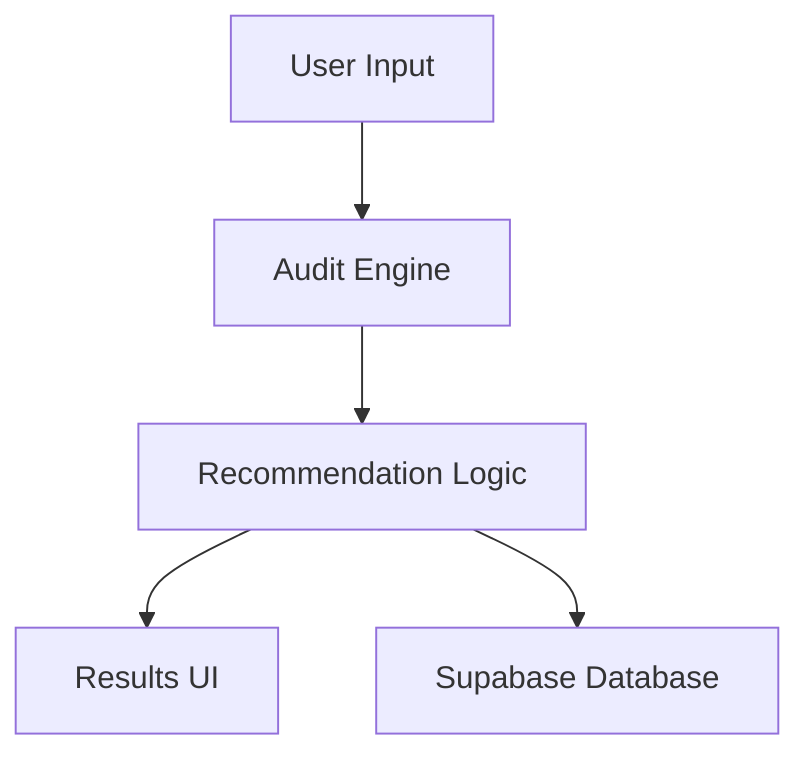

# Architecture

## Stack Choice

Next.js was selected for rapid full-stack development and Vercel deployment compatibility.

## Scaling

At larger scale:
- API routes would be separated
- Redis caching added
- Background jobs used for AI summaries